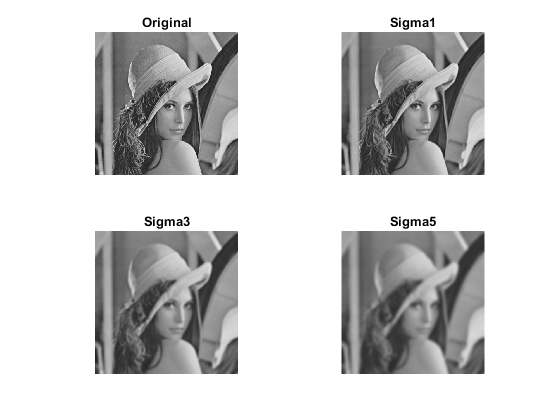
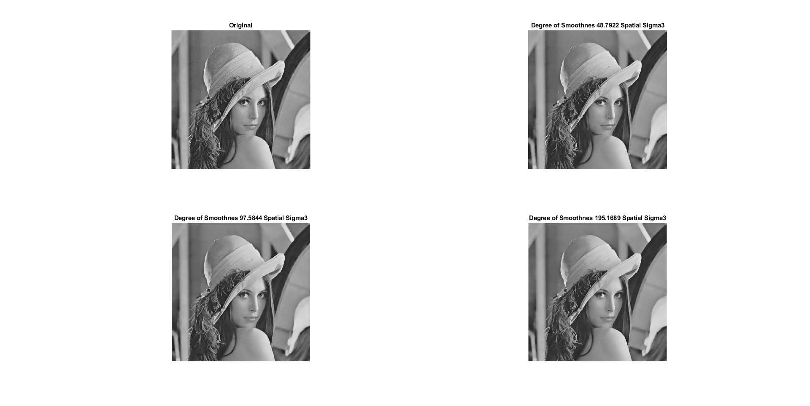
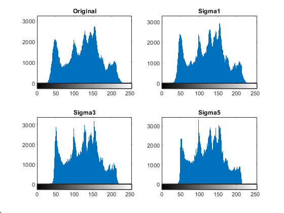
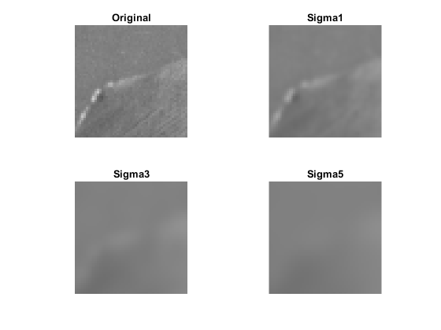
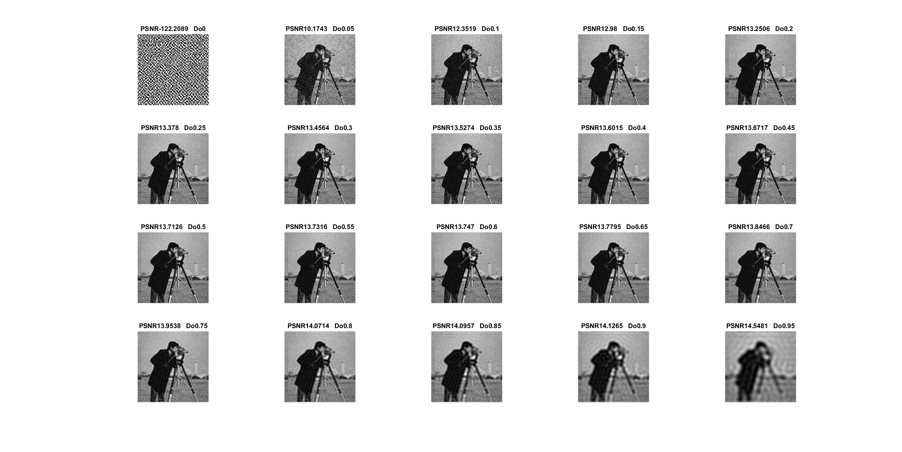
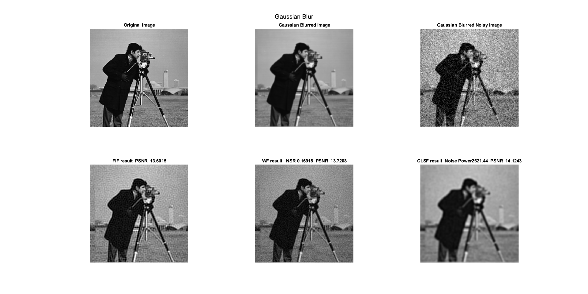
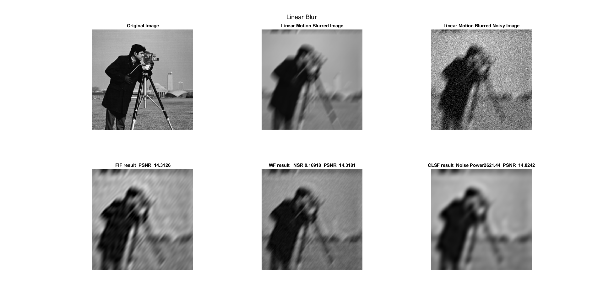
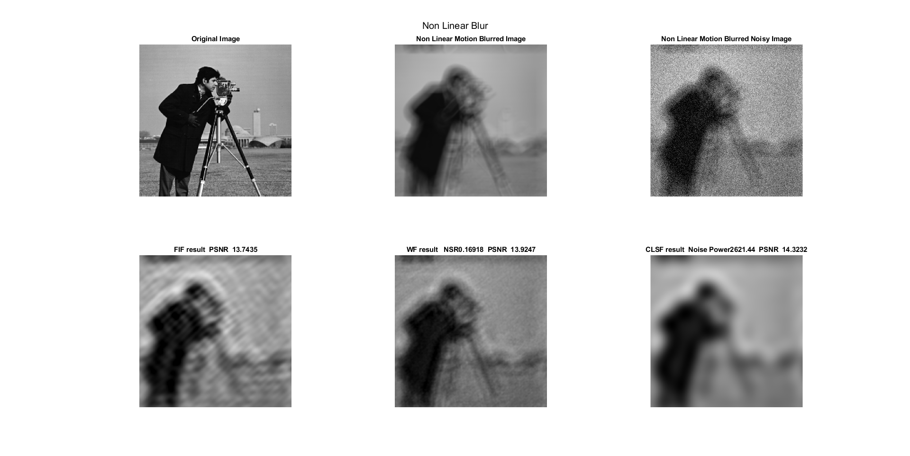

# Digital Image Processing Project

Done to satisfy the Project Requirement for Special Topics course EENG860 at New York Institute of Technology

# Project 1
Guassian and Bilateral Filtering

## Guassian Filtering


## Bilateral Filtering


### Histogram Analysis


### Patch Analysis


# Project 2
Denoising Images using FIF, Wiener and CLSF.

## Filter Inverse Filter Implementation

```
function [outputArg1] = inverse_filter(cam_blur_noise,PSF,Do)

%cam_blur_noise is the degraded image
%PSF is the the blurred
%Do is the cuttoff

%Inverse Filter
%Computer Fast Fourier Transform

H = fft2(PSF);
G = fft2(cam_blur_noise);

outputArg1 = fftshift(ifft2((abs(H) > Do).*G./H));
end
```


## FIF vs WNR vs CLSF

### Gaussian Blur and Filtering


### Linear Blur and Filtering


### Non-Linear Blur and Filtering
